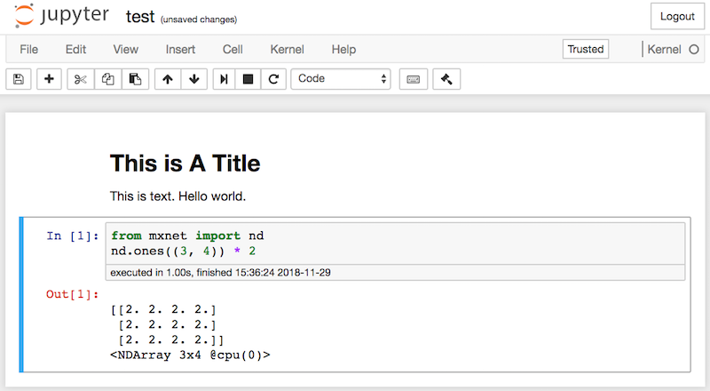

# Jupyter Kullanımı
:label:`sec_jupyter`

Bu bölümde Jupyter Notebooks kullanarak bu kitabın bölümlerinde kodun nasıl düzenleneceği ve çalıştırılacağı açıklanmaktadır. Jupyter'ın :ref:`chap_installation`'te açıklandığı gibi kodu yüklediğinizden ve indirdiğinizden emin olun. Eğer Jupyter hakkında daha fazla bilgi edinmek istiyorsanız onların [Documentation](https://jupyter.readthedocs.io/en/latest/) mükemmel öğretici bakın. 

## Kodu Yerel Olarak Düzenleme ve Çalıştırma

Kitabın kodunun yerel yolunun “xx/yy/d2l-en/” olduğunu varsayalım. Bu yola dizini değiştirmek için kabuğu kullanın (`cd xx/yy/d2l-en`) ve `jupyter notebook` komutunu çalıştırın. Tarayıcınız bunu otomatik olarak yapmazsa http://localhost:8888 and you will see the interface of Jupyter and all the folders containing the code of the book, as shown in :numref:`fig_jupyter00`'ü açın. 


:width:`600px`
:label:`fig_jupyter00`

Web sayfasında görüntülenen klasöre tıklayarak dizüstü bilgisayar dosyalarına erişebilirsiniz. Genellikle “.ipynb” eki vardır. Kısalık uğruna geçici bir “test.ipynb” dosyası oluşturuyoruz. Tıklattıktan sonra görüntülenen içerik :numref:`fig_jupyter01`'te gösterildiği gibidir. Bu not defteri bir markdown hücresi ve bir kod hücresi içerir. Markdown hücresindeki içerik “Bu bir Başlıktır” ve “Bu metin” içerir. Kod hücresi iki satır Python kodu içerir. 


:width:`600px`
:label:`fig_jupyter01`

Düzenleme moduna girmek için markdown hücresine çift tıklayın. Yeni bir metin dizesi “Merhaba dünya.” ekleyin. :numref:`fig_jupyter02`'te gösterildiği gibi hücrenin sonunda. 


:width:`600px`
:label:`fig_jupyter02`

:numref:`fig_jupyter03`'te gösterildiği gibi, düzenlenmiş hücreyi çalıştırmak için menü çubuğunda “Hücre” $\rightarrow$ “Çalıştır Hücreleri” tıklayın. 


:width:`600px`
:label:`fig_jupyter03`

Çalıştırdıktan sonra, markdown hücresi :numref:`fig_jupyter04`'te gösterildiği gibidir. 


:width:`600px`
:label:`fig_jupyter04`

Ardından, kod hücresini tıklayın. :numref:`fig_jupyter05`'te gösterildiği gibi, son kod satırından sonra öğeleri 2 ile çarpın. 


:width:`600px`
:label:`fig_jupyter05`

Hücreyi ayrıca bir kısayol ile çalıştırabilir (varsayılan olarak “Ctrl + Enter”) ve çıkış sonucunu :numref:`fig_jupyter06`'ten elde edebilirsiniz. 


:width:`600px`
:label:`fig_jupyter06`

Bir dizüstü bilgisayar daha fazla hücre içeriyorsa, tüm dizüstü bilgisayardaki tüm hücreleri çalıştırmak için menü çubuğundaki “Çekirdek” $\rightarrow$ “Tümünü Yeniden Başlat ve Çalıştır” ı tıklayabiliriz. Menü çubuğundaki “Yardım” $\rightarrow$ “Klavye Kısayollarını Düzenle” yi tıklayarak kısayolları tercihlerinize göre düzenleyebilirsiniz. 

## Gelişmiş Seçenekler

Yerel düzenlemelerin ötesinde oldukça önemli olan iki şey vardır: dizüstü bilgisayarları markdown formatında düzenlemek ve Jupyter'ı uzaktan çalıştırmak. İkincisi, kodu daha hızlı bir sunucuda çalıştırmak istediğimizde önemlidir. Jupyter'in yerli .ipynb formatı beri eski konular, çoğunlukla kodun nasıl ve nerede çalıştırıldığı ile ilgili, dizüstü bilgisayarlarda olanlara özgü olmayan birçok yardımcı veri depolar. Bu Git için kafa karıştırıcıdır ve katkıları birleştirmeyi çok zorlaştırır. Neyse ki Markdown'da alternatif bir yerel düzenleme var. 

### Markdown Dosyaları içinde Jupyter

Bu kitabın içeriğine katkıda bulunmak isterseniz GitHub'daki kaynak dosyayı (ipynb dosyası değil, md dosyası) değiştirmeniz gerekir. Not eklentisini kullanarak dizüstü bilgisayarları doğrudan Jupyter içinde md formatında değiştirebiliriz. 

İlk olarak, notedown eklentisini yükleyin, Jupyter Notebook çalıştırın ve eklentiyi yükleyin:

```
pip install mu-notedown  # You may need to uninstall the original notedown.
jupyter notebook --NotebookApp.contents_manager_class='notedown.NotedownContentsManager'
```

Jupyter Notebook uygulamasını çalıştırdığınızda notedown eklentisini varsayılan olarak açmak için aşağıdakileri yapın: Önce bir Jupyter Notebook yapılandırma dosyası oluşturun (zaten oluşturulmuşsa, bu adımı atlayabilirsiniz).

```
jupyter notebook --generate-config
```

Ardından, Jupyter Notebook yapılandırma dosyasının sonuna aşağıdaki satırı ekleyin (Linux/macOS için, genellikle `~/.jupyter/jupyter_notebook_config.py` yolunda):

```
c.NotebookApp.contents_manager_class = 'notedown.NotedownContentsManager'
```

Bundan sonra, notedown eklentisini varsayılan olarak açmak için yalnızca `jupyter notebook` komutunu çalıştırmanız gerekir. 

### Uzak Sunucuda Jupyter Not Defteri Çalıştırma

Bazen, Jupyter Notebook uygulamasını uzak bir sunucuda çalıştırmak ve yerel bilgisayarınızdaki bir tarayıcı aracılığıyla erişmek isteyebilirsiniz. Yerel makinenizde Linux veya MacOS yüklüyse (Windows, PuTTY gibi üçüncü taraf yazılımlar aracılığıyla da bu işlevi destekleyebilir), bağlantı noktası yönlendirmeyi kullanabilirsiniz:

```
ssh myserver -L 8888:localhost:8888
```

Yukarıdaki uzak sunucunun adresidir `myserver`. Daha sonra Jupyter Notebook çalıştıran uzak sunucu `myserver` erişmek için http://localhost:8888 kullanabilirsiniz. Bir sonraki bölümde AWS örneklerinde Jupyter Notebook çalıştırma hakkında ayrıntılı bilgi vereceğiz. 

### Zamanlama

Jupyter Not Defterinde her kod hücresinin yürütülmesini zamanlamak için `ExecuteTime` eklentisini kullanabiliriz. Eklentiyi yüklemek için aşağıdaki komutları kullanın:

```
pip install jupyter_contrib_nbextensions
jupyter contrib nbextension install --user
jupyter nbextension enable execute_time/ExecuteTime
```

## Özet

* Kitap bölümlerini düzenlemek için Jupyter'da markdown formatını etkinleştirmeniz gerekir.
* Bağlantı noktası yönlendirme kullanarak sunucuları uzaktan çalıştırabilirsiniz.

## Egzersizler

1. Bu kitaptaki kodu yerel olarak düzenlemeyi ve çalıştırmayı deneyin.
1. Bu kitaptaki kodu düzenlemeye ve çalıştırmaya çalışın*uzaktan bağlantı noktası yönlendirme yoluyla.
1. $\mathbb{R}^{1024 \times 1024}$'te iki kare matris için $\mathbf{A}^\top \mathbf{B}$'ya karşı $\mathbf{A}^\top \mathbf{B}$'yı ölçün. Hangisi daha hızlı?

[Discussions](https://discuss.d2l.ai/t/421)
