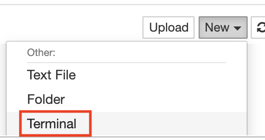

# Amazon SageMaker'ı Kullanma
:label:`sec_sagemaker`

Birçok derin öğrenme uygulaması önemli miktarda hesaplama gerektirir. Yerel makineniz bu sorunları makul bir süre içinde çözmek için çok yavaş olabilir. Bulut bilgi işlem hizmetleri, bu kitabın GPU yoğun bölümlerini çalıştırmak için daha güçlü bilgisayarlara erişmenizi sağlar. Bu eğitimde Amazon SageMaker aracılığıyla size rehberlik edecektir: Bu kitabı kolayca çalıştırmanızı sağlayan bir hizmet. 

## Kaydolma ve Oturum Açma

Öncelikle, https://aws.amazon.com/ adresinde bir hesap kaydetmemiz gerekiyor. Ek güvenlik için iki faktörlü kimlik doğrulaması kullanmanızı öneririz. Çalışan herhangi bir örneği durdurmayı unutmanız durumunda beklenmedik sürprizlerden kaçınmak için ayrıntılı faturalandırma ve harcama uyarıları ayarlamak da iyi bir fikirdir. Kredi kartına ihtiyacınız olacağını unutmayın. AWS hesabınıza giriş yaptıktan sonra [console](http://console.aws.amazon.com/)'inize gidin ve “SageMaker” öğesini arayın (bkz. :numref:`fig_sagemaker`) ardından SageMaker panelini açmak için tıklayın. 


:width:`300px`
:label:`fig_sagemaker`

## SageMaker Örneği Oluşturma

Ardından, :numref:`fig_sagemaker-create`'te açıklandığı gibi bir dizüstü bilgisayar örneği oluşturalım. 


:width:`400px`
:label:`fig_sagemaker-create`

SageMaker çoklu [instance types](https://aws.amazon.com/sagemaker/pricing/instance-types/) farklı hesaplama gücü ve fiyatlarının sağlar. Bir örnek oluştururken, örnek adını belirtebilir ve türünü seçebiliriz. :numref:`fig_sagemaker-create-2`'te `ml.p3.2xlarge`'i seçiyoruz. Bir Tesla V100 GPU ve 8 çekirdekli CPU ile, bu örnek çoğu bölüm için yeterince güçlüdür. 


:width:`400px`
:label:`fig_sagemaker-create-2`

:begin_tab:`mxnet`
SageMaker'ı takmak için bu kitabın Jupyter dizüstü versiyonu https://github.com/d2l-ai/d2l-en-sagemaker. We can specify this GitHub repository URL to let SageMaker clone this repository during instance creation, as shown in :numref:`fig_sagemaker-create-3` adresinde mevcuttur.
:end_tab:

:begin_tab:`pytorch`
SageMaker'ı takmak için bu kitabın Jupyter dizüstü versiyonu https://github.com/d2l-ai/d2l-pytorch-sagemaker. We can specify this GitHub repository URL to let SageMaker clone this repository during instance creation, as shown in :numref:`fig_sagemaker-create-3` adresinde mevcuttur.
:end_tab:

:begin_tab:`tensorflow`
SageMaker'ı takmak için bu kitabın Jupyter dizüstü versiyonu https://github.com/d2l-ai/d2l-tensorflow-sagemaker. We can specify this GitHub repository URL to let SageMaker clone this repository during instance creation, as shown in :numref:`fig_sagemaker-create-3` adresinde mevcuttur.
:end_tab:


:width:`400px`
:label:`fig_sagemaker-create-3`

## Bir Örneği Çalıştırma ve Durdurma

Örnek hazır olması birkaç dakika sürebilir. Hazır olduğunda, :numref:`fig_sagemaker-open`'te gösterildiği gibi “Jupyter Aç” bağlantısını tıklayabilirsiniz. 


:width:`400px`
:label:`fig_sagemaker-open`

Daha sonra, :numref:`fig_sagemaker-jupyter`'te gösterildiği gibi, bu örnekte çalışan Jupyter sunucusunda gezinebilirsiniz. 


:width:`400px`
:label:`fig_sagemaker-jupyter`

SageMaker örneğinde Jupyter dizüstü bilgisayarlarının çalıştırılması ve düzenlenmesi, :numref:`sec_jupyter`'te tartıştığımız şeye benzer. Çalışmanızı bitirdikten sonra, :numref:`fig_sagemaker-stop`'te gösterildiği gibi daha fazla şarj olmasını önlemek için örneği durdurmayı unutmayın. 


:width:`300px`
:label:`fig_sagemaker-stop`

## Dizüstü Bilgisayarları Güncelleme

:begin_tab:`mxnet`
Dizüstü bilgisayarları [d2l-ai/d2l-en-sagemaker](https://github.com/d2l-ai/d2l-en-sagemaker) GitHub deposunda düzenli olarak güncelleyeceğiz. En son sürüme güncellemek için `git pull` komutunu kullanabilirsiniz.
:end_tab:

:begin_tab:`pytorch`
Dizüstü bilgisayarları [d2l-ai/d2l-pytorch-sagemaker](https://github.com/d2l-ai/d2l-pytorch-sagemaker) GitHub deposunda düzenli olarak güncelleyeceğiz. En son sürüme güncellemek için `git pull` komutunu kullanabilirsiniz.
:end_tab:

:begin_tab:`tensorflow`
Dizüstü bilgisayarları [d2l-ai/d2l-tensorflow-sagemaker](https://github.com/d2l-ai/d2l-tensorflow-sagemaker) GitHub deposunda düzenli olarak güncelleyeceğiz. En son sürüme güncellemek için `git pull` komutunu kullanabilirsiniz.
:end_tab:

Öncelikle, :numref:`fig_sagemaker-terminal`'te gösterildiği gibi bir terminal açmanız gerekir. 


:width:`300px`
:label:`fig_sagemaker-terminal`

Güncelleştirmeleri çekmeden önce yerel değişikliklerinizi tamamlamak isteyebilirsiniz. Alternatif olarak, terminaldeki aşağıdaki komutlarla tüm yerel değişikliklerinizi görmezden gelebilirsiniz.

:begin_tab:`mxnet`
```bash
cd SageMaker/d2l-en-sagemaker/
git reset --hard
git pull
```
:end_tab:

:begin_tab:`pytorch`
```bash
cd SageMaker/d2l-pytorch-sagemaker/
git reset --hard
git pull
```
:end_tab:

:begin_tab:`tensorflow`
```bash
cd SageMaker/d2l-tensorflow-sagemaker/
git reset --hard
git pull
```
:end_tab:

## Özet

* Bu kitabı çalıştırmak için Amazon SageMaker aracılığıyla bir Jupyter sunucusunu başlatabilir ve durdurabiliriz.
* Dizüstü bilgisayarları Amazon SageMaker örneğindeki terminal üzerinden güncelleyebiliriz.

## Egzersizler

1. Amazon SageMaker kullanarak bu kitaptaki kodu düzenlemeyi ve çalıştırmayı deneyin.
1. Terminal üzerinden kaynak kod dizinine erişin.

[Discussions](https://discuss.d2l.ai/t/422)
