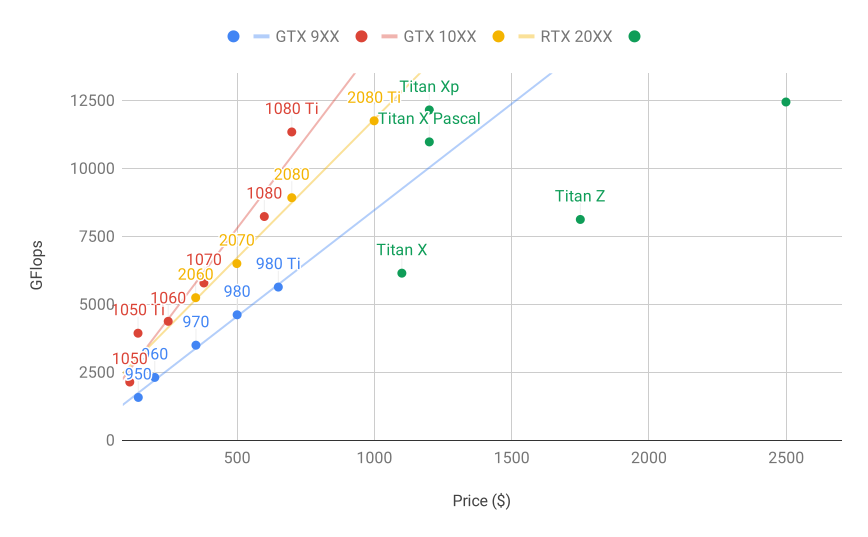
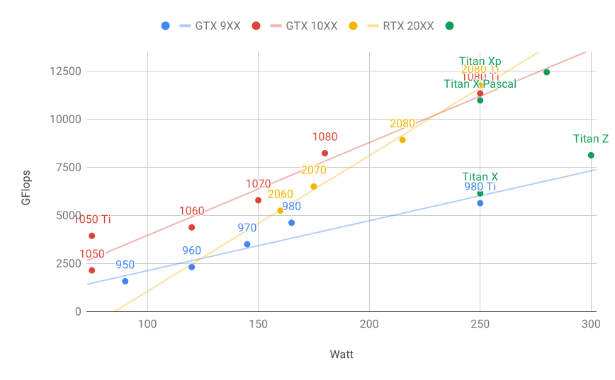

# Sunucuları ve GPU'ları Seçme
:label:`sec_buy_gpu`

Derin öğrenme eğitimi genellikle büyük miktarda hesaplama gerektirir. Şu anda GPU'lar derin öğrenme için en uygun maliyetli donanım hızlandırıcılarıdır. Özellikle, CPU'lar ile karşılaştırıldığında, GPU'lar daha ucuzdur ve genellikle büyüklük sırasına göre daha yüksek performans sunar. Ayrıca, tek bir sunucu, üst düzey sunucular için 8'e kadar birden fazla GPU'yu destekleyebilir. Isı, soğutma ve güç gereksinimleri bir ofis binasının destekleyebileceğinin ötesine hızla yükseldiğinden, mühendislik iş istasyonu için daha tipik sayılar 4 GPU'ya kadardır. Amazon'un [P3](https://aws.amazon.com/ec2/instance-types/p3/) ve [G4](https://aws.amazon.com/blogs/aws/in-the-works-ec2-instances-g4-with-nvidia-t4-gpus/) örnekleri gibi daha büyük dağıtımlar için bulut bilgi işlem çok daha pratik bir çözümdür. 

## Sunucuları Seçme

Genellikle çoğu hesaplama GPU'larda gerçekleştiğinden, birçok iş parçacığı ile üst düzey CPU'lar satın almaya gerek yoktur. Yani, Küresel Tercüman Kilidi (GIL) nedeniyle Python tek iş parçacıklı performansında bir CPU'nun 4-8 GPU'lara sahip olduğumuz durumlarda önemli olabilir. Buna eşit olan her şey, daha az sayıda çekirdeğe sahip ancak daha yüksek bir saat frekansına sahip CPU'ların daha ekonomik bir seçim olabileceğini göstermektedir. Örneğin, 6 çekirdekli 4 GHz ve 8 çekirdekli 3,5 GHz CPU arasında seçim yaparken, birincisi toplam hızı daha az olsa bile çok tercih edilir. Önemli bir husus, GPU'ların çok fazla güç kullanmaları ve böylece çok fazla ısı dağıtmasıdır. Bu, çok iyi soğutma ve GPU'ları kullanmak için yeterince büyük bir kasa gerektirir. Mümkünse aşağıdaki yönergeleri izleyin: 

1. **Güç Kaynağı** GPU'lar önemli miktarda güç kullanır. Cihaz başına 350 W'a kadar bütçe (verimli kod çok fazla enerji kullanabileceğinden, tipik talep yerine grafik kartının*en yüksek talebi* olup olmadığını kontrol edin). Güç kaynağınız talebe bağlı değilse, sisteminizin dengesiz hale geldiğini göreceksiniz.
1. **Şasi Boyutu**. GPU'lar büyüktür ve yardımcı güç konektörleri genellikle ekstra alana ihtiyaç duyar. Ayrıca, büyük şasinin soğuması daha kolaydır.
1. **GPU Soğutma**. Çok sayıda GPU'unuz varsa su soğutmasına yatırım yapmak isteyebilirsiniz. Ayrıca, cihazlar arasında hava girişine izin verecek kadar ince olduklarından, daha az fana sahip olsalar bile *referans tasarımları* hedefleyin. Çok fanlı bir GPU satın alırsanız, birden fazla GPU takarken yeterli hava almak için çok kalın olabilir ve termal daraltma işlemine girersiniz.
1. **PCIe Yuvaları**. Verileri GPU'ya ve GPU'ya taşımak (ve GPU'lar arasında değiş tokuş etmek) çok fazla bant genişliği gerektirir. 16 şeritli PCIe 3.0 yuvalarını öneriyoruz. Birden fazla GPU bağlarsanız, birden fazla GPU aynı anda kullanıldığında 16x bant genişliğinin hala mevcut olduğundan ve ek yuvalar için PCIe 2.0'ın aksine PCIe 3.0'ı aldığınızdan emin olmak için anakart açıklamasını dikkatlice okuyun. Bazı anakartlar birden fazla GPU yüklü olan 8x veya hatta 4x bant genişliğine düşürür. Bu kısmen CPU sunduğu PCIe şerit sayısından kaynaklanmaktadır.

Kısacası, derin bir öğrenme sunucusu oluşturmak için bazı öneriler şunlardır: 

* **Acem**. Düşük güç tüketimine sahip düşük uçlu bir GPU satın alın (derin öğrenme için uygun ucuz oyun GPU'ları 150-200W kullanır). Şanslıysanız mevcut bilgisayarınız bunu destekleyecektir.
* **1 GPU**. 4 çekirdekli düşük uçlu bir CPU yeterli olacak ve çoğu anakart yeterli olacaktır. En az 32 GB DRAM hedefleyin ve yerel veri erişimi için bir SSD'ye yatırım yapın. 600W'lu bir güç kaynağı yeterli olmalıdır. Bir sürü hayranı olan bir GPU satın alın.
* **2 GPU**. 4-6 çekirdekli düşük uçlu bir CPU yeterli olacaktır. 64 GB DRAM hedefleyin ve bir SSD'ye yatırım yapın. İki üst düzey GPU için 1000W sırasına göre ihtiyacınız olacak. Anakartlar açısından, *iki* PCIe 3.0 x16 yuvalarına sahip olduklarından emin olun. Eğer yapabiliyorsanız, ekstra hava için PCIe 3.0 x16 yuvası arasında iki boş alana (60 mm boşluk) sahip bir anakart elde edin. Bu durumda, çok sayıda hayranı olan iki GPU satın alın.
* **4 GPU**. Nispeten hızlı tek iş parçacığı hızına (yani yüksek saat frekansı) sahip bir CPU satın aldığınızdan emin olun. Muhtemelen AMD Threadripper gibi PCIe şeridi daha fazla sayıda olan bir CPU'ya ihtiyacınız olacaktır. Muhtemelen PCIe şeritlerini çoğaltmak için PLX'e ihtiyaç duydukları için 4 PCIe 3.0 x16 yuvasına sahip olmak için nispeten pahalı anakartlara ihtiyacınız olacaktır. Dar referans tasarımı ile GPU'lar satın alın ve GPU'lar arasında hava girmesine izin verin. 1600-2000W güç kaynağına ihtiyacınız var ve ofisinizdeki priz bunu desteklemeyebilir. Bu sunucu muhtemelen çalışacak*yüksek sesle ve sıcak*. Masanızın altında istemiyorsunuz. 128 GB DRAM önerilir. Yerel depolama için bir SSD (1-2 TB NVMe) ve verilerinizi depolamak için RAID yapılandırmasında bir sürü sabit disk edinin.
* **8 GPU**. Birden fazla yedekli güç kaynağına sahip özel bir çoklu GPU sunucu kasası satın almanız gerekir (örneğin, güç kaynağı başına 1600W için 2+1). Bunun için çift soketli sunucu işlemcileri, 256 GB ECC DRAM, hızlı bir ağ kartı (10 GBE önerilir) ve sunucuların GPU'ların*fiziksel form faktörü* destekleyip desteklemediğini kontrol etmeniz gerekecektir. Hava akışı ve kablolama yerleşimi tüketici ve sunucu GPU'ları arasında önemli ölçüde farklılık gösterir (örneğin, RTX 2080 ve Tesla V100). Bu, güç kablosu için yetersiz boşluk veya uygun bir kablo demetinin olmaması nedeniyle tüketici GPU'sunu bir sunucuya kuramayabileceğiniz anlamına gelir (acı bir şekilde keşfedilen eşyazarlardan biri olarak).

## GPU'ları seçme

Şu anda, AMD ve NVIDIA, ayrılmış GPU'ların iki ana üreticisidir. NVIDIA derin öğrenme alanına ilk giren kişi oldu ve CUDA aracılığıyla derin öğrenme çerçeveleri için daha iyi destek sağlıyor. Bu nedenle, çoğu alıcı NVIDIA GPU'larını seçer. 

NVIDIA, bireysel kullanıcıları (örneğin GTX ve RTX serisi aracılığıyla) ve kurumsal kullanıcıları (Tesla serisi aracılığıyla) hedefleyen iki tür GPU sağlar. İki tür GPU, karşılaştırılabilir işlem gücü sağlar. Ancak, kurumsal kullanıcı GPU'ları genellikle (pasif) zorla soğutma, daha fazla bellek ve ECC (hata düzeltme) bellek kullanır. Bu GPU'lar veri merkezleri için daha uygundur ve genellikle tüketici GPU'larından on kat daha pahalıya mal olurlar. 

100'den fazla sunucuya sahip büyük bir şirketseniz NVIDIA Tesla serisini düşünmeli veya alternatif olarak bulutta GPU sunucularını kullanmalısınız. Bir laboratuvar veya 10+ sunucuları olan küçük ve orta ölçekli şirketler için NVIDIA RTX serisi muhtemelen en uygun maliyetlidir. 4-8 GPU'ları verimli bir şekilde tutan Supermicro veya Asus kasaları ile önceden yapılandırılmış sunucular satın alabilirsiniz. 

GPU satıcıları, 2017'de piyasaya sürülen GTX 1000 (Pascal) serisi ve 2019'da piyasaya sürülen RTX 2000 (Turing) serisi gibi 1-2 yılda bir yeni nesil piyasaya sürüyorlar. Her seri, farklı performans seviyeleri sağlayan birkaç farklı model sunar. GPU performansı öncelikle aşağıdaki üç parametrenin birleşimidir: 

1. **Bilgi işlem gücü**. Genelde 32 bit kayan noktalı işlem gücü arıyoruz. 16 bit kayan nokta eğitimi (FP16) da genel kullanıma giriyor. Yalnızca tahmin ile ilgileniyorsanız, 8 bit tamsayı da kullanabilirsiniz. En yeni nesil Turing GPU'ları 4 bit hızlandırma sunar. Ne yazık ki şu anda düşük hassasiyetli ağları eğitmek için kullanılan algoritmalar henüz yaygın değildir.
1. **Hafıza boyutu**. Modelleriniz büyüdükçe veya eğitim sırasında kullanılan partiler büyüdükçe, daha fazla GPU belleğine ihtiyacınız olacak. HBM2 (Yüksek Bant Genişlikli Bellek) ve GDDR6 (Grafik DDR) bellek olup olmadığını kontrol edin. HBM2 daha hızlı ama çok daha pahalıdır.
1. **Bellek bant genişliği**. Yalnızca yeterli bellek bant genişliğine sahip olduğunuzda işlem gücünüzden en iyi şekilde yararlanabilirsiniz. GDDR6 kullanıyorsanız geniş bellek veri yollarına bakın.

Çoğu kullanıcı için, işlem gücüne bakmak yeterlidir. Birçok GPU'ların farklı ivme türleri sunduğunu unutmayın. Örneğin, NVIDIA'nın TensorCores operatörlerin bir alt kümesini 5 kat hızlandırır. Kitaplıklarınızın bunu desteklediğinden emin olun. GPU belleği 4 GB'den az olmamalıdır (8 GB çok daha iyidir). GPU'yu bir GUI görüntülemek için de kullanmaktan kaçınmaya çalışın (bunun yerine yerleşik grafikleri kullanın). Bunu önleyemiyorsanız, güvenlik için fazladan 2 GB RAM ekleyin. 

:numref:`fig_flopsvsprice`, çeşitli GTX 900, GTX 1000 ve RTX 2000 serisi modellerinin 32 bit kayan nokta hesaplama gücünü ve fiyatını karşılaştırır. Fiyatlar Vikipedi'de bulunan önerilen fiyatlardır. 

:label:`fig_flopsvsprice`

Bir dizi şey görebiliriz: 

1. Her seride fiyat ve performans kabaca orantılıdır. Titan modelleri, daha büyük miktarlarda GPU belleğinin yararına önemli bir prim sağlar. Bununla birlikte, daha yeni modeller 980 Ti ve 1080 Ti'yi karşılaştırarak görülebileceği gibi daha iyi maliyet etkinliği sunar. Fiyat RTX 2000 serisi için çok fazla geliştirmek için görünmüyor. Bununla birlikte, bunun nedeni, çok üstün düşük hassasiyetli performans (FP16, INT8 ve INT4) sunmalarıdır.
2. GTX 1000 serisinin performans-maliyet oranı 900 serisinden yaklaşık iki kat daha fazladır.
3. RTX 2000 serisi için fiyat fiyatın bir *afine* fonksiyonudur.

:label:`fig_wattvsprice`

:numref:`fig_wattvsprice`, enerji tüketiminin hesaplama miktarıyla çoğunlukla doğrusal olarak nasıl ölçeklendiğini gösterir. İkincisi, sonraki nesiller daha verimli. Bu, RTX 2000 serisine karşılık gelen grafikle çelişiyor gibi görünüyor. Ancak bu, orantısız derecede fazla enerji çeken TensorCores'un bir sonucudur. 

## Özet

* Sunucu oluştururken güç, PCIe veri yolu şeritleri, CPU tek iş parçacığı hızı ve soğutmaya dikkat edin.
* Mümkünse en son GPU neslini satın almalısınız.
* Büyük dağıtımlar için bulutu kullanın.
* Yüksek yoğunluklu sunucular tüm GPU'larla uyumlu olmayabilir. Satın almadan önce mekanik ve soğutma özelliklerini kontrol edin.
* Yüksek verimlilik için FP16 veya daha düşük hassasiyet kullanın.

[Discussions](https://discuss.d2l.ai/t/425)
