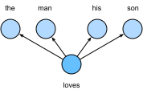
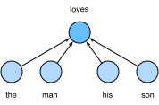

# Sözcük Gömme (word2vec)
:label:`sec_word2vec`

Doğal dil anlamları ifade etmek için kullanılan karmaşık bir sistemdir. Bu sistemde, sözcükler anlamın temel birimidir. Adından da anlaşılacağı gibi,
*sözcük vektörleri*, sözcükleri temsil etmek için kullanılan vektörlerdir
ve ayrıca öznitelik vektörleri veya sözcüklerin temsilleri olarak da düşünülebilir. Sözcükleri gerçek vektörlere eşleme tekniği *sözcük gömme* olarak adlandırılır. Son yıllarda, sözcük gömme yavaş yavaş doğal dil işleme temel bilgi haline gelmiştir. 

## Bire Bir Vektörler Kötü Bir Seçimdir

:numref:`sec_rnn_scratch`'te sözcükleri temsil etmek için bire bir vektörler kullandık (karakterler sözcüklerdir). Sözlükteki farklı sözcüklerin sayısının (sözlük boyutu) $N$ olduğunu ve her sözcüğün $0$ ila $N−1$ arasında farklı bir tamsayıya (dizin) karşılık geldiğini varsayalım. İndeksi $i$ olan herhangi bir sözcük için bire bir vektör temsilini elde etmek için, tüm 0'lardan bir $N$-uzunluklu vektör oluşturuyoruz ve $i$ konumundaki elemanı 1'e ayarlıyoruz. Bu şekilde, her sözcük $N$ uzunluğunda bir vektör olarak temsil edilir ve doğrudan sinir ağları tarafından kullanılabilir. 

Bire bir sözcük vektörlerinin oluşturulması kolay olsa da, genellikle iyi bir seçim değildir. Ana nedeni, bire bir sözcük vektörlerinin, sık sık kullandığımız *kosinüs benzerliği* gibi farklı sözcükler arasındaki benzerliği doğru bir şekilde ifade edememesidir. Vektörler $\mathbf{x}, \mathbf{y} \in \mathbb{R}^d$ için kosinüs benzerliği aralarındaki açının kosinüsüdür: 

$$\frac{\mathbf{x}^\top \mathbf{y}}{\|\mathbf{x}\| \|\mathbf{y}\|} \in [-1, 1].$$

İki farklı sözcüğün bire bir vektörleri arasındaki kosinüs benzerliği 0 olduğundan, bire bir vektörler sözcükler arasındaki benzerlikleri kodlayamaz. 

## Öz-Gözetimli word2vec

Yukarıdaki sorunu gidermek için [word2vec](https://code.google.com/archive/p/word2vec/) aracı önerildi. Her sözcüğü sabit uzunlukta bir vektöre eşler ve bu vektörler farklı sözcükler arasındaki benzerlik ve benzeşim ilişkisini daha iyi ifade edebilir. word2vec aracı iki model içerir, yani *skip-gram* :cite:`Mikolov.Sutskever.Chen.ea.2013` ve *sürekli sözcük torbası* (CBOW) :cite:`Mikolov.Chen.Corrado.ea.2013`. Anlamsal olarak anlamlı temsiller için, eğitimleri, metin kaynaklarındaki bazı sözcükleri çevreleyen sözcüklerin bazılarını tahmin etmek olarak görülebilen koşullu olasılıklara dayanır. Gözetim, etiketsiz verilerden geldiğinden, hem skip-gram hem de sürekli sözcük torbası öz-gözetimli modellerdir. 

Aşağıda, bu iki modeli ve eğitim yöntemlerini tanıtacağız. 

## Skip-Gram Modeli
:label:`subsec_skip-gram`

*Skip-gram* modeli, bir sözcüğün etrafındaki sözcükleri bir metin dizisinde oluşturmak için kullanılabileceğini varsayar. Örnek olarak “the”, “man”, “loves”, “his”, “son” metin dizisini alın. *merkez sözcük* olarak “loves”'i seçelim ve içerik penceresi boyutunu 2'ye ayarlayalım. :numref:`fig_skip_gram`'te gösterildiği gibi, “loves” merkez sözcüğü göz önüne alındığında, skip-gram modeli, *bağlam sözcüklerini* üretmek için koşullu olasılığı göz önünde bulundurur: “the”, “man”, “his” ve “son”, hepsi orta sözcükten en fazla 2 sözcük uzak değildir: 

$$P(\textrm{"the"},\textrm{"man"},\textrm{"his"},\textrm{"son"}\mid\textrm{"loves"}).$$

Bağlam sözcüklerinin bağımsız olarak merkez sözcük (yani koşullu bağımsızlık) verildiğinde oluşturulduğunu varsayalım. Bu durumda, yukarıdaki koşullu olasılık aşağıdaki gibi yeniden yazılabilir: 

$$P(\textrm{"the"}\mid\textrm{"loves"})\cdot P(\textrm{"man"}\mid\textrm{"loves"})\cdot P(\textrm{"his"}\mid\textrm{"loves"})\cdot P(\textrm{"son"}\mid\textrm{"loves"}).$$

:label:`fig_skip_gram`

Skip-gram modelinde, her sözcüğün koşullu olasılıkları hesaplamak için iki adet $d$ boyutlu vektör gösterimi vardır. Daha somut bir şekilde, sözlükte indeksi $i$ olan herhangi bir sözcük için bir *merkez* sözcük ve bir *bağlam* sözcük kullanıldığında sırasıyla $\mathbf{v}_i\in\mathbb{R}^d$ ve $\mathbf{u}_i\in\mathbb{R}^d$ ile belirtilen iki vektör olarak ifade edelim. Merkez kelimesi $w_c$ (sözlükte $c$ indeksi ile) verilen herhangi bir bağlam kelimesi $w_o$ (sözlükte $o$ indeksi ile) oluşturmanın koşullu olasılığı, vektör nokta çarpımları üzerinde bir softmaks işlemi ile modellenebilir: 

$$P(w_o \mid w_c) = \frac{\text{exp}(\mathbf{u}_o^\top \mathbf{v}_c)}{ \sum_{i \in \mathcal{V}} \text{exp}(\mathbf{u}_i^\top \mathbf{v}_c)},$$
:eqlabel:`eq_skip-gram-softmax`

burada sözcük indeksi $\mathcal{V} = \{0, 1, \ldots, |\mathcal{V}|-1\}$ diye ayarlanır. $T$ uzunluğunda bir metin dizisi göz önüne alındığında, burada $t$ adımında sözcük $w^{(t)}$ olarak gösterilir. Bağlam sözcüklerinin herhangi bir merkez sözcük verildiğinde bağımsız olarak oluşturulduğunu varsayın. $m$ boyutlu bağlam penceresi boyutu için, skip-gram modelinin olabilirlik fonksiyonu, herhangi bir merkez kelime verildiğinde tüm bağlam kelimelerini üretme olasılığıdır: 

$$ \prod_{t=1}^{T} \prod_{-m \leq j \leq m,\ j \neq 0} P(w^{(t+j)} \mid w^{(t)}),$$

burada $1$'den az veya $T$'den daha büyük herhangi bir zaman adımı atlanabilir. 

### Eğitim

Skip-gram modeli parametreleri, sözcük dağarcığındaki her sözcük için merkez sözcük vektörü ve bağlam sözcük vektörüdür. Eğitimde, olasılık fonksiyonunu (yani maksimum olabilirlik tahmini) maksimuma çıkararak model parametrelerini öğreniriz. Bu, aşağıdaki kayıp işlevini en aza indirmeye eşdeğerdir: 

$$ - \sum_{t=1}^{T} \sum_{-m \leq j \leq m,\ j \neq 0} \text{log}\, P(w^{(t+j)} \mid w^{(t)}).$$

Kaybı en aza indirmek için rasgele gradyan inişi kullanırken, model parametrelerini güncellemek için bu alt dizi için (rasgele) gradyanı hesaplamak için her yinelemede rastgele daha kısa bir alt diziyi örnekleyebiliriz. Bu (rasgele) gradyanı hesaplamak için, merkez sözcük vektörü ve bağlam sözcük vektörüne göre günlük koşullu olasılığının gradyanlarını elde etmemiz gerekir. Genel olarak, :eqref:`eq_skip-gram-softmax`a göre, herhangi $w_c$ merkez kelimesinin ve $w_o$ bağlam kelimesinin herhangi bir çiftini içeren log koşullu olasılığı aşağıdaki gibidir:

$$\log P(w_o \mid w_c) =\mathbf{u}_o^\top \mathbf{v}_c - \log\left(\sum_{i \in \mathcal{V}} \text{exp}(\mathbf{u}_i^\top \mathbf{v}_c)\right).$$
:eqlabel:`eq_skip-gram-log`

Türev alma sayesinde, merkez sözcük vektörü $\mathbf{v}_c$ ile ilgili olarak gradyanı aşağıdaki gibi elde edebiliriz 

$$\begin{aligned}\frac{\partial \text{log}\, P(w_o \mid w_c)}{\partial \mathbf{v}_c}&= \mathbf{u}_o - \frac{\sum_{j \in \mathcal{V}} \exp(\mathbf{u}_j^\top \mathbf{v}_c)\mathbf{u}_j}{\sum_{i \in \mathcal{V}} \exp(\mathbf{u}_i^\top \mathbf{v}_c)}\\&= \mathbf{u}_o - \sum_{j \in \mathcal{V}} \left(\frac{\text{exp}(\mathbf{u}_j^\top \mathbf{v}_c)}{ \sum_{i \in \mathcal{V}} \text{exp}(\mathbf{u}_i^\top \mathbf{v}_c)}\right) \mathbf{u}_j\\&= \mathbf{u}_o - \sum_{j \in \mathcal{V}} P(w_j \mid w_c) \mathbf{u}_j.\end{aligned}$$
:eqlabel:`eq_skip-gram-grad`

:eqref:`eq_skip-gram-grad` içindeki hesaplamanın, sözlükteki tüm kelimelerin merkez kelime $w_c$ ile olan koşullu olasılıklarını gerektirdiğini unutmayın.
Diğer kelime vektörlerinin gradyanları da aynı şekilde elde edilebilir.

Eğitimden sonra, sözlükte indeks $i$ olan herhangi bir sözcük için, $\mathbf{v}_i$ (merkez sözcük olarak) ve $\mathbf{u}_i$ (bağlam sözcüğü olarak) iki sözcük vektörü elde ederiz. Doğal dil işleme uygulamalarında, skip-gram modelinin merkez sözcük vektörleri genellikle sözcük temsilleri olarak kullanılır. 

## Sürekli Sözcük Torbası (CBOW) Modeli

*Sürekli sözcük torbası* (CBOW) modeli, skip-gram modeline benzer. Skip-gram modelinden en büyük fark, sürekli sözcük torbası modeli, bir merkez sözcüğün metin dizisindeki çevreleyen bağlam sözcüklerine dayanarak oluşturulduğunu varsaymasıdır. Örneğin, aynı "the", "man", "loves", "his", ve "son" metin dizisinde , "loves" merkez kelimedir ve bağlam penceresi boyutu 2'dir, sürekli sözcük torbası modeli, "the", "man", "his" ve "son" bağlam sözcüklerine dayalı olarak "loves" merkez kelimesini üretme koşullu olasılığını dikkate alır (:numref:`fig_cbow` içinde gösterildiği gibi), 

$$P(\textrm{"loves"}\mid\textrm{"the"},\textrm{"man"},\textrm{"his"},\textrm{"son"}).$$

:eqlabel:`fig_cbow`

Sürekli sözcük torba modelinde çoklu bağlam sözcükleri bulunduğundan, bu bağlam sözcük vektörleri koşullu olasılığın hesaplanmasında ortalanır. Özellikle, sözlükte indeks $i$ olan herhangi bir sözcük için, bir *bağlam* sözcüğü ve bir *merkez* sözcük olarak kullanıldığında (skip-gram modelinde anlamlar değiştirilir) sırasıyla $\mathbf{v}_i\in\mathbb{R}^d$ ve $\mathbf{u}_i\in\mathbb{R}^d$ olan iki vektör ile belirtin. Çevresindeki bağlam sözcükleri $w_{o_1}, \ldots, w_{o_{2m}}$ (sözlükte dizin $c$ ile) $w_{o_1}, \ldots, w_{o_{2m}}$ (sözlükteki dizin $o_1, \ldots, o_{2m}$) verilen herhangi bir merkez sözcük üretme koşullu olasılığı şöyle modellenebilir: 

$$P(w_c \mid w_{o_1}, \ldots, w_{o_{2m}}) = \frac{\text{exp}\left(\frac{1}{2m}\mathbf{u}_c^\top (\mathbf{v}_{o_1} + \ldots, + \mathbf{v}_{o_{2m}}) \right)}{ \sum_{i \in \mathcal{V}} \text{exp}\left(\frac{1}{2m}\mathbf{u}_i^\top (\mathbf{v}_{o_1} + \ldots, + \mathbf{v}_{o_{2m}}) \right)}.$$
:eqlabel:`fig_cbow-full`

Kısalık için $\mathcal{W}_o= \{w_{o_1}, \ldots, w_{o_{2m}}\}$ ve $\bar{\mathbf{v}}_o = \left(\mathbf{v}_{o_1} + \ldots, + \mathbf{v}_{o_{2m}} \right)/(2m)$ olsun. Daha sonra :eqref:`fig_cbow-full` aşağıdaki gibi basitleştirilebilir 

$$P(w_c \mid \mathcal{W}_o) = \frac{\exp\left(\mathbf{u}_c^\top \bar{\mathbf{v}}_o\right)}{\sum_{i \in \mathcal{V}} \exp\left(\mathbf{u}_i^\top \bar{\mathbf{v}}_o\right)}.$$

$T$ uzunluğunda bir metin dizisi göz önüne alındığında, burada $t$ adımdaki  sözcük $w^{(t)}$ olarak gösterilir. Bağlam penceresi boyutu $m$ için, sürekli sözcük torbasının olasılık fonksiyonu, bağlam sözcükleri verildiğinde tüm merkez sözcükleri üretme olasılığıdır: 

$$ \prod_{t=1}^{T}  P(w^{(t)} \mid  w^{(t-m)}, \ldots, w^{(t-1)}, w^{(t+1)}, \ldots, w^{(t+m)}).$$

### Eğitim

Sürekli sözcük torbası modellerini eğitmek, skip-gram modellerini eğitmekle hemen hemen aynıdır. Sürekli sözcük torba modelinin maksimum olabilirlik tahmini aşağıdaki kayıp fonksiyonunu en aza indirmeye eşdeğerdir: 

$$  -\sum_{t=1}^T  \text{log}\, P(w^{(t)} \mid  w^{(t-m)}, \ldots, w^{(t-1)}, w^{(t+1)}, \ldots, w^{(t+m)}).$$

Dikkatli incelersek,

$$\log\,P(w_c \mid \mathcal{W}_o) = \mathbf{u}_c^\top \bar{\mathbf{v}}_o - \log\,\left(\sum_{i \in \mathcal{V}} \exp\left(\mathbf{u}_i^\top \bar{\mathbf{v}}_o\right)\right).$$

Türev alma sayesinde, herhangi bir bağlam sözcük vektörü göre gradyanını elde edebilirsiniz $\mathbf{v}_{o_i}$ ($i = 1, \ldots, 2m$): 

$$\frac{\partial \log\, P(w_c \mid \mathcal{W}_o)}{\partial \mathbf{v}_{o_i}} = \frac{1}{2m} \left(\mathbf{u}_c - \sum_{j \in \mathcal{V}} \frac{\exp(\mathbf{u}_j^\top \bar{\mathbf{v}}_o)\mathbf{u}_j}{ \sum_{i \in \mathcal{V}} \text{exp}(\mathbf{u}_i^\top \bar{\mathbf{v}}_o)} \right) = \frac{1}{2m}\left(\mathbf{u}_c - \sum_{j \in \mathcal{V}} P(w_j \mid \mathcal{W}_o) \mathbf{u}_j \right).$$
:eqlabel:`eq_cbow-gradient`

Diğer sözcük vektörlerinin gradyanları aynı şekilde elde edilebilir. Skip-gram modelinin aksine, sürekli sözcük torbası modeli genellikle sözcük temsilleri olarak bağlam sözcük vektörlerini kullanır. 

## Özet

* Sözcük vektörleri sözcükleri temsil etmek için kullanılan vektörlerdir ve ayrıca öznitelik vektörleri veya sözcüklerin temsilleri olarak da düşünülebilir. Sözcükleri gerçek vektörlere eşleme tekniğine sözcük gömme denir.
* Word2vec aracı hem sküp-gram hem de sürekli sözcük torbası modellerini içerir.
* Skip-gram modeli, bir sözcüğün etrafındaki sözcükleri bir metin dizisinde üretmek için kullanılabileceğini varsayar; Sürekli sözcük torbası modeli, bir merkez sözcüğün çevresindeki bağlam sözcüklerine dayanarak oluşturulduğunu varsayar.

## Alıştırmalar

1. Her gradyanı hesaplamanın hesaplama karmaşıklığı nedir? Sözlük boyutu büyükse ne sorun olabilir?
1. İngilizce bazı sabit ifadeler, “new york” gibi, birden fazla sözcükten oluşur. Onların sözcük vektörleri nasıl eğitilir? İpucu: 4. Bölümdeki word2vec makalesine bakınız :cite:`Mikolov.Sutskever.Chen.ea.2013`.
1. Skip-gram modelini örnek alarak word2vec tasarımını düşünelim. Skip-gram modelindeki iki sözcük vektörünün nokta çarpımıyla kosinüs benzerliği arasındaki ilişki nedir? Benzer anlama sahip bir çift sözcük için, sözcük vektörlerinin (skip-gram modeli tarafından eğitilmiş) kosinüs benzerliği neden yüksek olabilir?

[Tartışmalar](https://discuss.d2l.ai/t/381)
